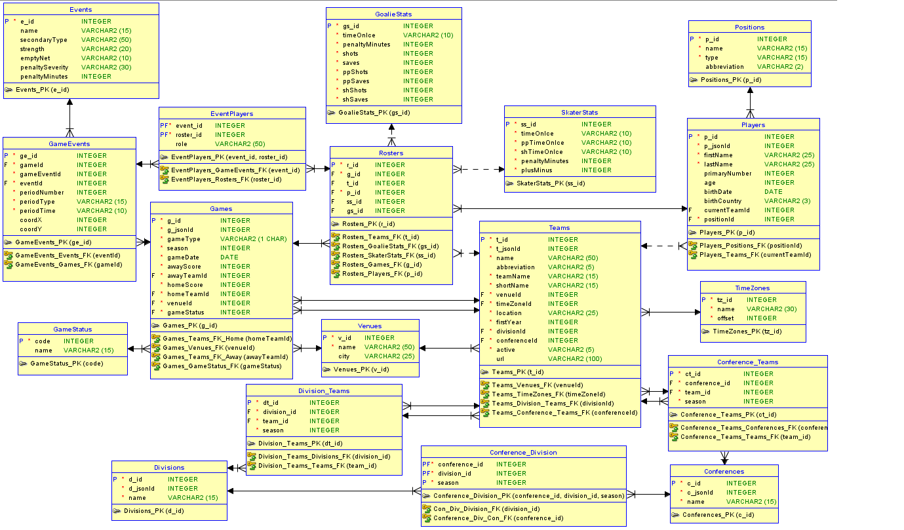

# Nhl data loader

## Loads data from free api - https://statsapi.web.nhl.com/api/v1/schedule?teamId=[teamid]&startDate=[date]&endDate=[date] into class model through Gson library and saves the data into Oracle db using procedures.

### Db scripts (procedures, functions and db creation scripts):  

 included in DBScripts folder. 

### Db relation model:

